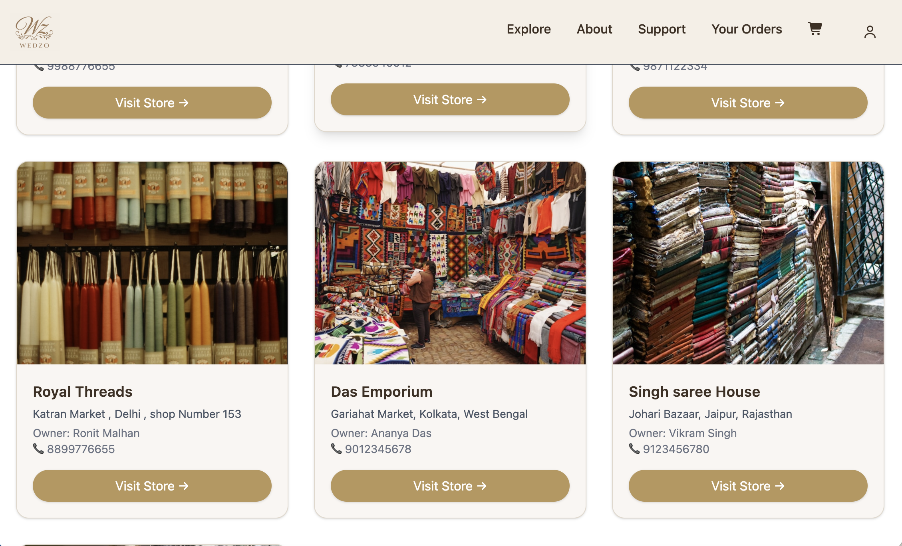
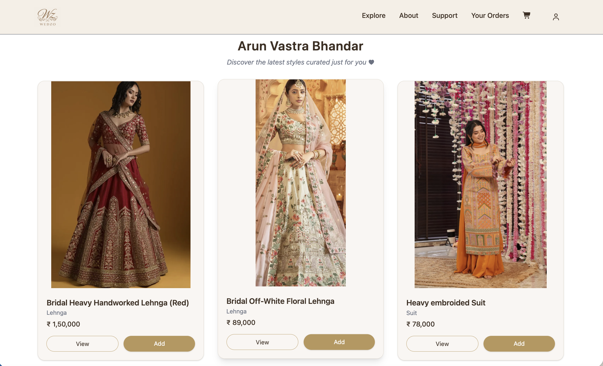
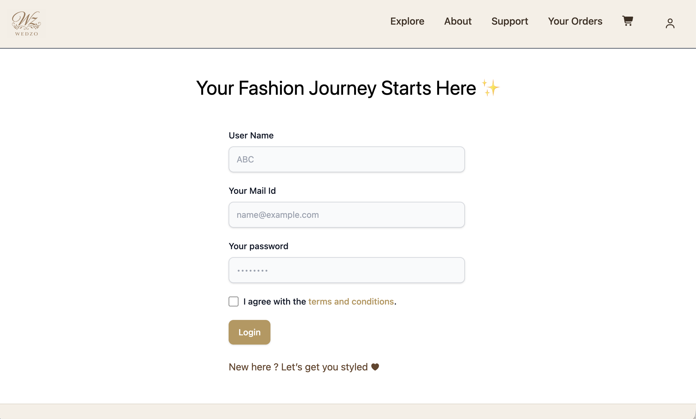
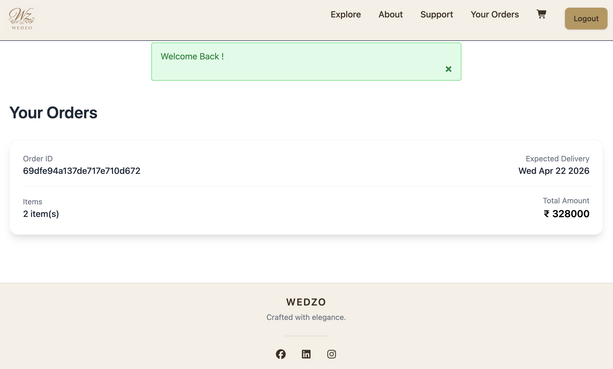
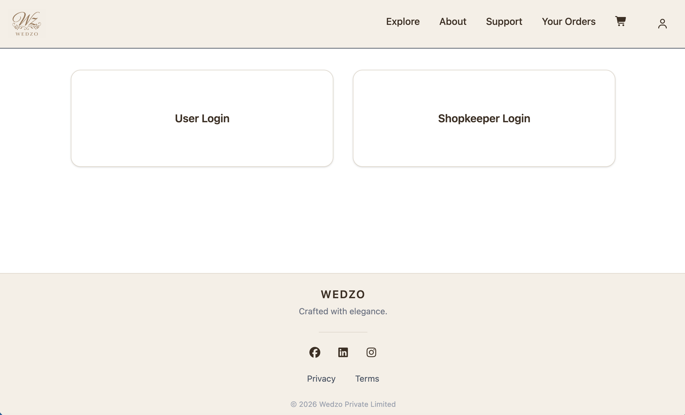
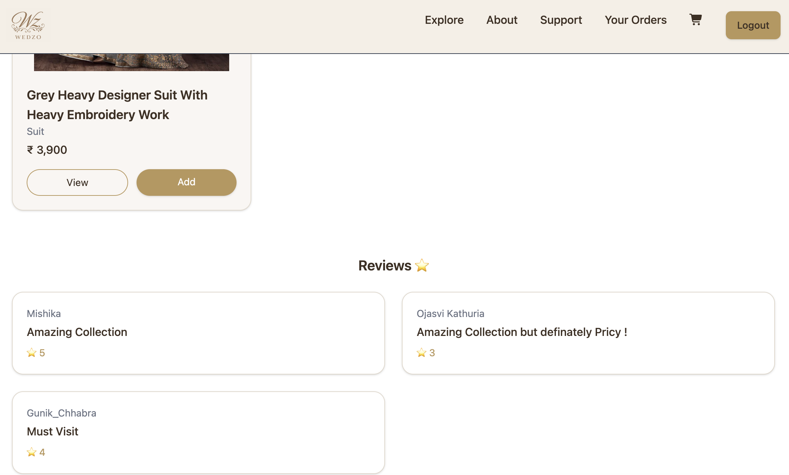
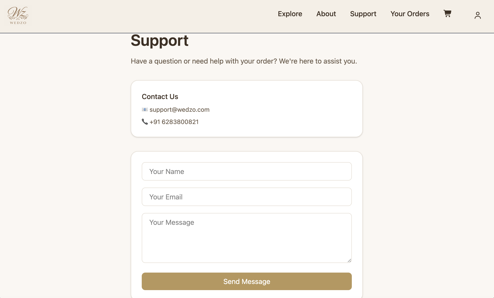

## Wedzo  
 A full-stack e-commerce platform focused on bridal fashion and local boutique discovery. A platform that connects Indian brides with boutiques across India, making wedding shopping easier and accessible.
 Built with Node.js, Express, MongoDB and deployed on Render

## 🔗 Live Demo  
https://wedzo-7wu8.onrender.com/

## Why Wedzo?

Bridal shopping in India often means going through crowded markets with hundreds of options, which can be overwhelming and time-consuming.  
At the same time, many local boutiques and small sellers don’t have an online presence, making it difficult for them to reach a wider audience.
Wedzo aims to simplify this by bringing multiple boutiques onto a single platform, allowing users to explore and shop easily from anywhere.

## Tech Stack  

- **Frontend:** EJS, Tailwind CSS, EJS-Mate  
- **Backend:** Node.js, Express.js  
- **Database:** MongoDB (MongoDB Atlas)  
- **Authentication:** Passport.js, express-session, connect-mongo  
- **File Uploads:** Multer, Cloudinary  
- **Validation & Utilities:** Joi, connect-flash  
- **Tools:** Concurrently  
- **Architecture:** MVC (Model-View-Controller)  

## ✨ Features  

- User authentication (Sign up / Login)  
- Secure password handling using Passport.js  
- Role-based access (User / Shopkeeper)  
- Browse products from multiple boutiques  
- Add products to cart  
- Persistent cart linked to user account  
- Update quantity and manage cart items  
- Smooth checkout flow with address form  
- Cash on Delivery (COD) payment option  
- Place orders and store order details  
- Basic order management system  
- Shopkeeper panel to add and manage products  
- Protected routes using authentication middleware  
- RESTful APIs for products, cart, and orders  
- Server-side validation for secure data handling  
- Responsive and clean user interface  
- Deployed on Render  

---

## 📸 Screenshots  

### 🏠 Homepage  

### 🛍️ Shop  

### 🔐 Login  

### 📝 Signup  

### 🛒 Cart  

### 📦 Orders  

### 🧑‍💼 Shopkeeper Panel  

### ⭐ Reviews  

### 💬 Support  

##  Future Improvements  

- Online payment integration (UPI / Cards)  
- Advanced filtering (price, category, location)    
- Order tracking system  
- Notifications for orders  
- Shopkeeper analytics dashboard  

##  Note  
 This project is actively being improved and new features are being added.

## Contact  

For feedback or suggestions, feel free to reach out.
📧 [Click here to email](mailto:chhabragunik21@gmail.com@gmail.com)
